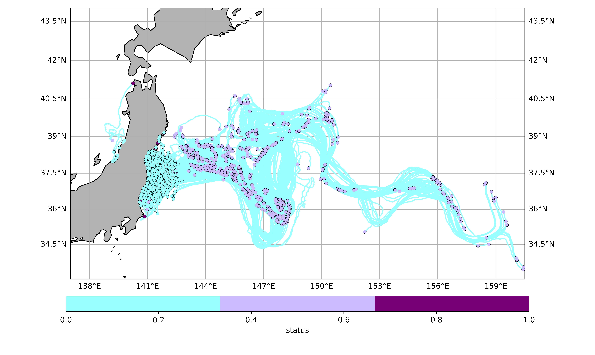

# Japan_drifte
# 🌊 Drift Prediction of Wastewater near Japan Using OpenDrift



## 📝 Project Overview

This project simulates the **drift of wastewater particles near the coastal waters of Japan** using the [OpenDrift](https://opendrift.github.io/) particle tracking framework. The goal is to estimate the dispersion pattern of potentially contaminated water over time under the influence of ocean currents and wind.

The figure above illustrates a 1-month simulation from **2022-06-01 00:00 UTC to 2022-07-01 00:00 UTC**, visualizing particle trajectories and their final states after 721 simulation steps.

## 📌 Key Features

- **Region Covered**: Northwestern Pacific Ocean around Japan (approx. 137°E–160°E, 34°N–44°N)
- **Particles Released**: 2000 particles representing wastewater input
- **Simulation Duration**: 30 days
- **Forcing Data**: Ocean currents and wind (e.g., ERA5/CMEMS)
- **Output Categories**:
  - `initial` (cyan): Starting positions  
  - `active` (purple): Still drifting  
  - `stranded` (dark purple): Particles stranded or settled  

## 🛠️ Technologies Used

- `Python 3.x`
- `OpenDrift` (OceanDrift model)
- `Cartopy` & `Matplotlib` for visualization
- `netCDF4` readers for ocean/wind data

## 📕 Get Data
- **Flow field data can be downloaded from https://data.marine.copernicus.eu/product/GLOBAL_ANALYSISFORECAST_PHY_001_024/download**
- **Wind field data can be downloaded from https://cds.climate.copernicus.eu/datasets/reanalysis-era5-single-levels?tab=download**

## 🚀 How to Run

1. **Clone this repository:**
2. **Install https://conda-forge.org/miniforge/**
```bash
cd Japan_drifter
```
3. **Create environment with the required dependencies and install OpenDrift**
```bash
$ mamba env create -f environment.yml
$ conda activate opendrift
$ pip install --no-deps -e .
```
4. ***This will install the env from the opendrift, You do not need to add the opendrift to the PATH.***
5. ***Then the local conda environment can be updated with:***
```bash 
$ mamba env update -f environment.yml
```
## Animation results


